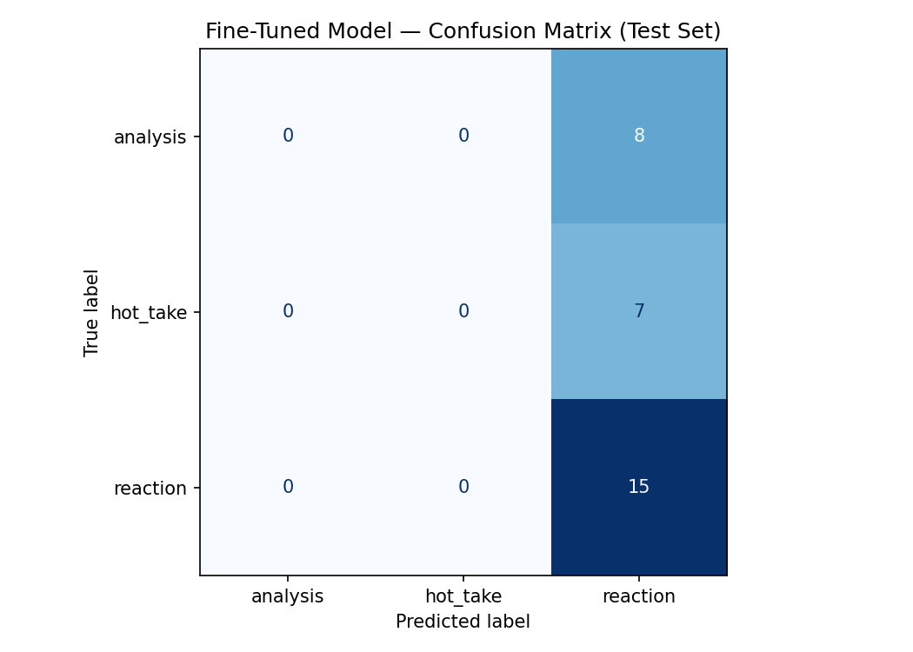
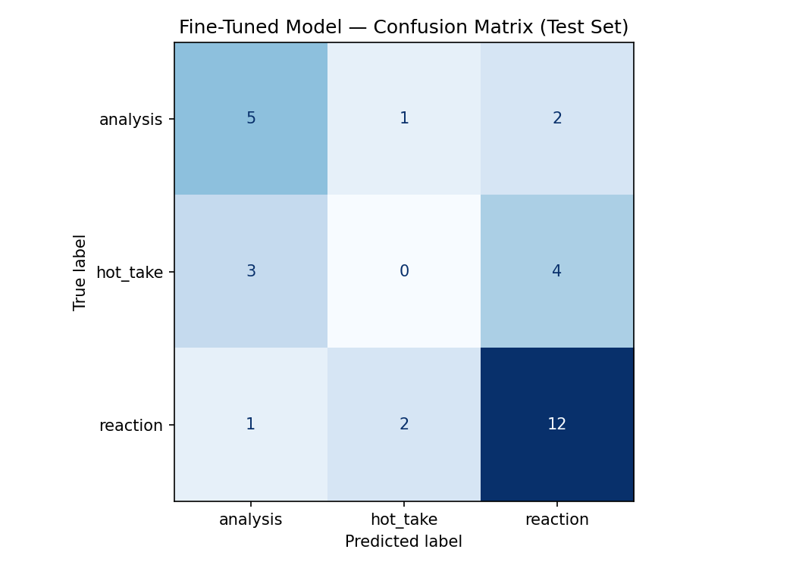

# TakeMeter — Planning & Technical Report

**TakeMeter** — a fine-tuned `distilbert-base-uncased` text classifier that scores **discourse quality** in a football (soccer) community by sorting comments into three mutually exclusive labels: `analysis`, `hot_take`, and `reaction`.

---

## 1. Community

**Chosen community:** the active, public **FIFA World Cup discussion on r/worldcup** (public Reddit match threads, post-match threads, and World Cup megathreads), together with the same World Cup discourse as it surfaces in public comment sections. Every example is drawn from public posts, with no private channels and no content behind authentication.

**Why it is a compelling fit for text classification:** World Cup discourse is raw, text-heavy, and high-energy, and, critically, its quality varies *enormously within a single thread*. The same comment section contains:

- genuine tactical breakdowns (substitution logic, pressing shape, bracket math),
- confident, unbacked predictions and rankings fired off in the heat of a match,
- and pure emotional noise such as emoji cheers, jokes, and one-line laments.

That natural spread is precisely the signal a discourse-quality classifier needs to learn. Equally important, the **"hot take vs. analysis" distinction is one the community already polices itself** ("source?", "that's a hot take", "actual analysis here"), which grounds the labels in real community norms rather than imposing them from outside. The informality also raises the difficulty: fans build genuine arguments in slang and without citations, which is precisely where a general model struggles (see the baseline's conservatism in [Section 5](#5-evaluation-metrics--definition-of-success)).

---

## 2. Label Taxonomy

Three labels are defined, mutually exclusive (a comment belongs to exactly one) and exhaustive enough to label well over 90% of comments without an "other" bucket. Boundaries are stated as crisp, one-sentence rules.

### `analysis`

A comment makes a **structured argument** backed by specific evidence (tactical observation, lineup/substitution detail, individual-performance detail, match events, or metric/scenario reasoning) **and connects that evidence to *how* or *why* an outcome occurred.**

- *Example (row 120):* "Nagelsmann knew exactly what he was doing with the substitutions… first game this World Cup where a substitute scored a winning brace. Undav seriously played awesome." This names the coach, credits the substitution decision, and ties it directly to the result.
- *Example (row 134):* "if your opponent puts 11 people in the box for 90 minutes, there's not much you can do… the weaker nations that have lost, you can see they have possession of +35%." This connects a defensive tactic and a possession metric to *why* weaker sides lose.

### `hot_take`

A **bold, confident opinion, prediction, or ranking** stated as fact but lacking objective, verifiable evidence or depth, where the comment **asserts rather than argues.** The claim may even be correct, but nothing is built underneath it.

- *Example (row 3):* "usa is better than japan… they just dont have any talent really… no one ever won a world cup with 11 average players." This is a sweeping cross-country comparison with no supporting data.
- *Example (row 446):* "If African teams had the same budget as European teams, they would've won several World Cups already." This is a bold counterfactual asserted with nothing behind it.

### `reaction`

An **immediate, short, emotional** expression (celebration, disappointment, humor, a question, or baseline cheering tied to a moment) with **no analytical argument and no predictive scope.**

- *Example (row 34):* "1-0 or 2-0 CPV let's gooo" is a celebratory cheer.
- *Example (row 32):* "vozinha my goat 🐐" is player-hyping with emoji.

---

## 3. Hard Edge Cases & Explicit Decision Rules

The hardest anticipated edge case is the **"Borderline Stat Post"**: a comment references a concrete number (shots, possession %, a scoreline) or a tactic, but does so as a **brief, surface-level or emotional observation** rather than constructing a tactical, structural argument. Such posts *look* like `analysis` because they contain data, but the data is decorative; it sounds credible without actually reasoning. This is exactly the boundary the fine-tuned model has not yet learned (see the `hot_take` collapse in [Section 5](#5-evaluation-metrics--definition-of-success)).

**Explicit decision rule (applied at annotation time):**

> To be marked as `analysis`, the text must actively connect the metric or tactical observation to a **structural justification of the game's outcome**. If the evidence is vague, cherry-picked, or purely decorative (just enough to sound credible but not genuinely reasoning) it defaults to `hot_take` (if the tone is opinionated/provocative) or `reaction` (if the tone is descriptive or emotional).

### Three documented difficult rows and the decision made

1. **Surface-level stat citation → `hot_take`.** Row 114: *"The stat sheet clearly shows Germany controlled most of this Group E fixture, racking up far more shots and possession than Côte d'Ivoire."* (and the near-identical row 84 about Japan's "dominance"). Both cite real stats but never explain *how* the team converted possession/shots into control of the match. The number is the whole post, not the basis of an argument. **Decision: `hot_take`**, the canonical Borderline Stat Post.

2. **Qualification/bracket-scenario reasoning → `analysis`.** Row 228: *"With Netherlands hanging 5 on Sweden, Japan kinda needs a big number for a chance at winning the group."* (cf. rows 94, 230). Not match-tactical, but a genuinely structured logical argument that ties a result to an outcome (goal-difference math driving group standings). The reasoning is real and verifiable. **Decision: `analysis`.**

3. **Emotional praise wrapped around a token tactic word → `reaction`.** Row 224: *"…I'd rather watch a team park the bus than have no defense at all."* It names a recognizable tactic ("park the bus") but only as personal preference and appreciation; there is no structural account of why it shaped the result. The dominant register is emotional. **Decision: `reaction`** (a funny one-stat callout, row 244, "more shots at his own keeper than Ferran Torres", was adjudicated the same way: decorative stat, mocking tone, no argument).

---

## 4. Data Collection Plan & Distribution Safeguards

**Origin:** public World Cup comments were collected from r/soccer threads into `dataset/dataset-raw.txt`, then annotated one comment at a time against the [Section 2](#2-label-taxonomy) definitions (a per-row justification is stored in the `notes` column). Collection was manual and close to the data, deliberately not a scraping or engineering project.

**Target volume:** a minimum of **200 labeled examples** in a single combined CSV (`dataset/dataset-labeled.csv`, columns `text, label, notes`). The Colab notebook performs the 70 / 15 / 15 train / validation / test split automatically, so a single unsplit file is shipped (≈140 train / 30 validation / 30 test).

**Distribution safeguards against class imbalance:** every label must hold **≥20%** of the dataset and **no single label may exceed 70%**, so the model cannot win by defaulting to a majority class. `reaction` was naturally the largest class in the raw pass (158 rows); it was **downsampled to 102** by removing redundant clusters (goalkeeper-praise pile-ups, off-topic political/personal chatter, near-duplicates, and tight topic clusters such as the Philly-curse and VAR-reaction threads) while **retaining ≥1–2 exemplars of every reaction subtype** so the class stays linguistically varied. The exact 56-row drop set and the full label map are reproducible in `dataset/label_dataset.py`.

**Realized distribution (final, 200 examples):**

| label      | count   | share |
|------------|---------|-------|
| reaction   | 102     | 51%   |
| analysis   | 50      | 25%   |
| hot_take   | 48      | 24%   |
| **total**  | **200** | 100%  |

All three labels clear the ≥20% floor and sit well under the 70% ceiling. This safeguard governs the *dataset*: the random 70/15/15 split can still yield a small, skewed test fold (the locked 30-post test split, for instance, contains only 8 `analysis` cases), which directly motivates the per-class metrics in [Section 5](#5-evaluation-metrics--definition-of-success). **Underrepresentation rule:** if a label fell short, additional examples would be collected from the threads that surface it, namely post-match tactical subthreads for `analysis` and prediction/ranking threads for `hot_take`.

---

## 5. Evaluation Metrics & Definition of Success

### Metrics and why per-class F1 is mathematically essential

The evaluation reports **overall accuracy**, plus **per-class precision, recall, and F1** and **macro-F1**, alongside a **confusion matrix**.

### Stretch Feature (Bonus): Systematic error-pattern analysis — plan before implementation

This section is a pre-commit note before implementing the optional **Systematic error-pattern analysis** bonus feature in `README.md` (Bonus Section 3).

- **Working hypothesis**: `hot_take` is a “messy middle” class between `analysis` and `reaction`. On errors, the model will split true `hot_take` cases toward `analysis` when the post is longer / comparative / multi-clause, and toward `reaction` when the post is short and hype-like.
- **Data source**: the tuned run’s locked test split outputs from `colab/ai201_project3_takemeter_starter_tuned.ipynb` (the “Wrong predictions: 13 / 30” printout) and the tuned confusion matrix already embedded below.
- **Verification method**: manually re-read each misclassified true `hot_take` test example against the explicit decision rule in [Section 3](#3-hard-edge-cases--explicit-decision-rules) (“asserts vs. argues”), and support the claimed pattern with multiple examples from different subtypes (short hype-like vs. longer comparative takes). Reproducible exports are in `error_pattern_analysis/` (`misclassifications_tuned.json`, `error_pattern_analysis.py`).

Overall accuracy *alone is actively misleading* on this dataset, as the present run demonstrates. With `reaction` at 51% of the data, a model that predicts `reaction` for every input scores ~50% accuracy while learning nothing, which is exactly what the initial pipeline did ([Hyperparameter Evolution Log](#-hyperparameter-evolution-log) below): it flatlined at 0.50 accuracy and caught **0** `analysis` and **0** `hot_take` cases. A single accuracy number completely masked a total majority-class collapse.

**Per-class F1 is what exposes that collapse.** F1 is the harmonic mean of precision and recall, so a class the model never predicts has recall 0 → F1 = 0, no matter how high overall accuracy looks. Tracking F1 *per label* makes a hidden collapse impossible to conceal:

- It surfaced the original failure (analysis F1 = 0.00, hot_take F1 = 0.00).
- It surfaces the **current** failure: after the fix, overall accuracy rose to 56.7% and `analysis` F1 climbed from 0.00 → **0.59** (catching 5 of 8 test cases), yet **`hot_take` remains collapsed at F1 = 0.00.** Accuracy went up; per-class F1 reveals that one entire boundary is still unlearned.

The analysis tracks the confusion matrix's **`analysis` ↔ `hot_take`** and **`hot_take` → `reaction`** cells specifically, because `hot_take` linguistically occupies a "messy middle": it mixes highly emotional, provocative phrasing (resembling `reaction`) with surface-level mentions of players, matchups, and stats (resembling `analysis`). The model has not yet internalized the [Section 3](#3-hard-edge-cases--explicit-decision-rules) decision rule that separates a decorative stat from a structural argument, so `hot_take` examples are pulled toward whichever neighbor they momentarily resemble.

### Confusion matrices and result artifacts

Two fine-tuned runs are on record: the initial collapsed run and the current run produced after the hyperparameter fix ([Hyperparameter Evolution Log](#-hyperparameter-evolution-log)). The confusion matrices below make the contrast concrete; rows are the true label and columns are the predicted label.

**Initial run, total majority-class collapse** (`evaluation_results/confusion_matrix.png`):



| true ＼ pred | analysis | hot_take | reaction |
|--------------|----------|----------|----------|
| **analysis** | 0        | 0        | 8        |
| **hot_take** | 0        | 0        | 7        |
| **reaction** | 0        | 0        | 15       |

Every test post is predicted `reaction`. The model scores 15/30 = 50.0% accuracy purely from the majority class, while `analysis` and `hot_take` recall are both 0.

**Current run, after the warmup / epoch / learning-rate fix** (`evaluation_results/confusion_matrix_tuned.png`):



| true ＼ pred | analysis | hot_take | reaction |
|--------------|----------|----------|----------|
| **analysis** | 5        | 1        | 2        |
| **hot_take** | 3        | 0        | 4        |
| **reaction** | 1        | 2        | 12       |

The diagonal now carries 5 + 0 + 12 = 17 correct predictions (17/30 = 56.7%). `analysis` is recovered (5 of 8 caught, F1 ≈ 0.59), but the `hot_take` row still holds 0 on its diagonal: the collapse described in [Section 3](#3-hard-edge-cases--explicit-decision-rules) persists for that single boundary, with its 7 true cases split toward `analysis` (3) and `reaction` (4).

### Misclassified Test Examples (Fine-Tuned Model, Tuned Run)

The three examples below are from the tuned run’s 13 test-set errors. Each one shows a different kind of mistake from the confusion matrix above.

**Example 1 — `hot_take` misread as `analysis` (confidence: 0.43)**

> "This is hilarious. Japan have zero chance this century. If any team outside of Europe/SA are going to win it'll be an African country first before anywhere else. Weebs are seriously getting out of control"

*True label: `hot_take` → Predicted: `analysis`*

- **What went wrong:** long + comparative + multi-sentence → the model thinks `analysis`.
- **Why it should be `hot_take`:** it’s strong predictions stated like facts, but there’s no real evidence and no concrete why/how reasoning (per [Section 3](#3-hard-edge-cases--explicit-decision-rules)).
- **What this says about the boundary:** the model doesn’t really get “asserts vs. argues” yet, so confident comparisons get treated as analysis.

**Example 2 — `hot_take` misread as `reaction` (confidence: 0.58)**

> "Cabo verde are the real dark horses of this tournament"

*True label: `hot_take` → Predicted: `reaction`*

- **What went wrong:** it’s short and hype-y, so the model buckets it as `reaction`.
- **Why it should be `hot_take`:** “real dark horses” is a bold tournament claim with zero support (asserts, doesn’t argue).
- **Pattern:** short `hot_take` posts get absorbed into `reaction` because they look like cheering.

**Example 3 — `analysis` misread as `hot_take` (confidence: 0.41)**

> "Iran played haramball until Belgium got the red card and Iran came dangerously close to winning. This is a weird World Cup"

*True label: `analysis` → Predicted: `hot_take`*

- **What went wrong:** slang/tone (“haramball”, “weird”) makes the model hear “provocative opinion” → `hot_take`.
- **Why it should be `analysis`:** it points to a turning point (red card) and links it to a shift in the match (cause → effect).
- **Pattern:** real `analysis` written in messy fan language gets misread.

**Exported result artifacts.** The notebook writes one JSON summary per run; metric files live under `evaluation_results/`, and the tuned-run misclassification export lives in `error_pattern_analysis/misclassifications_tuned.json`. All are committed to the repository.

`evaluation_results/evaluation_results.json` (initial collapsed run):

```json
{
  "baseline_accuracy": 0.7,
  "finetuned_accuracy": 0.5,
  "improvement": -0.2,
  "test_set_size": 30,
  "label_map": { "analysis": 0, "hot_take": 1, "reaction": 2 },
  "model": "distilbert-base-uncased"
}
```

`evaluation_results/evaluation_results_tuned.json` (current run):

```json
{
  "baseline_accuracy": 0.7,
  "finetuned_accuracy": 0.5667,
  "improvement": -0.1333,
  "test_set_size": 30,
  "label_map": { "analysis": 0, "hot_take": 1, "reaction": 2 },
  "model": "distilbert-base-uncased"
}
```

The `improvement` field is the fine-tuned accuracy minus the zero-shot baseline; both runs are negative (−0.20 → −0.13), confirming that the fix narrowed but has not yet closed the gap to the 70.0% baseline.

### Baseline comparison (zero-shot)

The fine-tuned DistilBERT is scored against a **Groq `llama-3.3-70b-versatile` zero-shot** prompt on the *exact same 30-post locked test split*:

| Model                          | Overall accuracy | Notable per-class behavior                                                                 |
|--------------------------------|------------------|-------------------------------------------------------------------------------------------|
| Zero-shot Llama-3.3-70B (Groq) | **70.0%**        | `reaction` recall **1.00**; `analysis` recall only **0.25**, missing informal fan arguments |
| Fine-tuned DistilBERT (this work) | **56.7%**     | `analysis` F1 **0.59** (5/8); `hot_take` F1 **0.00** (still collapsed)                       |

The baseline is the bar to beat, and it is currently ahead on overall accuracy. Its **0.25 recall on `analysis`**, however, is the revealing weakness: a general 70B model is conservative about labelling a slangy, citation-free fan comment "analysis," and therefore under-recognizes exactly the substantive arguments the community values. This result is *informative* rather than a formality: it indicates that the task is hard for a general model and shows precisely where fine-tuning must add value (informal `analysis` recognition first, then the `hot_take` boundary).

### Definition of success ("good enough" to deploy)

If TakeMeter were deployed as a community moderation or sorting tool (e.g. auto-surfacing `analysis`, de-emphasizing low-effort `reaction`), "good enough" is defined as:

- **Overall accuracy ≥ 70%**, at least matching the zero-shot baseline, since a fine-tuned model that loses to a no-training prompt is not worth shipping.
- **Every per-class F1 ≥ 0.65**, with **no class collapsed** (the non-negotiable bar: a sorting tool that is structurally blind to `hot_take` is unusable for the one distinction the community cares most about).
- **Macro-F1 ≥ 0.70**, so minority-class performance is weighted equally and not hidden behind the dominant `reaction` class.

By this definition the target is not yet met: the collapse has been broken and the pipeline has been shown to learn `analysis`, but `hot_take` recovery and an accuracy/macro-F1 lift above the baseline remain open work.

---

## 6. AI Tool Plan & Usage Workflow

This project produces almost no implementation code, so AI tools were directed at the three places they genuinely help, each with a human-review gate.

- **Label stress-testing.** Claude was given the label definitions and edge-case description and asked to generate borderline `analysis`/`hot_take` posts. Posts it produced that could not be classified cleanly indicated that the definitions were too loose. *Outcome:* this directly produced the explicit "must connect the metric to a **structural justification of the outcome**" rule in [Section 3](#3-hard-edge-cases--explicit-decision-rules), written *before* annotating 200 examples.

- **Automated annotation assistance (LLM pre-labeling + manual review).** An LLM pre-labeled the raw comments against the taxonomy, emitting one label plus a one-line justification per row. **Every pre-assigned label was then reviewed and corrected by hand**, so pre-labeling sped up throughput, but the borderline rows in [Section 3](#3-hard-edge-cases--explicit-decision-rules) were re-adjudicated manually to avoid feeding noisy labels into training. The full mapping is tracked in `dataset/label_dataset.py` so the dataset is auditable and reproducible. *This pre-labeling is disclosed here and will be disclosed in the README's AI-usage section.*

- **Error / failure-pattern analysis.** After each training run, the misclassified test examples are passed to an LLM that is asked to surface patterns such as short or low-information posts, sarcasm, and directional confusions (e.g. `hot_take → reaction`). *Outcome:* this is how the `hot_take` "messy middle" failure mode was characterized. Every proposed pattern is then **verified by re-reading the actual rows** before it enters the evaluation report; the LLM proposes, the human confirms.

---

## 7. Spec Reflection

**One way the spec helped me**

- It forced me to name the hardest edge case *before* I labeled everything. That’s why the Borderline Stat Post rule exists in [Section 3](#3-hard-edge-cases--explicit-decision-rules), instead of being something I made up after the model failed.
- It also pushed me away from “accuracy-only.” That’s why [Section 5](#5-evaluation-metrics--definition-of-success) focuses on per-class F1, which is what exposed the majority-class collapse.

**One way my execution diverged from my intent**

- **Intent:** fine-tune on 200 balanced, hand-reviewed examples and at least match the 70% Groq zero-shot baseline.
- **Reality:** tuned run got **56.7% accuracy** and **`hot_take` F1 = 0.00**.
- **Why (my best read):** I fixed the training bug first ([Hyperparameter Evolution Log](#-hyperparameter-evolution-log)), but I didn’t do a second data pass to add more “clear-but-borderline” `hot_take` examples once I saw the collapse. So the model leaned on shallow cues (long = `analysis`, short hype = `reaction`) instead of the “asserts vs. argues” rule.

---

## 8. Stretch Feature Plan: Deployed Interface (Terminal CLI)

Before implementing the bonus **Deployed interface** feature, the design choice is to ship a small, dependency-light **terminal CLI** instead of a web UI:

- **Interface shape:** a Python script `classify.py` that loads the fine-tuned DistilBERT classifier from a local `takemeter-model/` directory and exposes:
  - a one‑shot mode (`python classify.py "post text here"`) and
  - an interactive REPL (`python classify.py` → type posts until a blank line).
- **Model dependency:** the fine-tuned weights are trained in `colab/ai201_project3_takemeter_starter_tuned.ipynb` and exported from Colab using the `trainer.save_model(...)` + `tokenizer.save_pretrained(...)` pattern. The exported directory is downloaded and unzipped into the repo root; we deliberately do **not** commit the large model files to git.
- **Behavioral parity with the notebook:** the CLI reuses the same configuration as the tuned Colab run:
  - label map `{"analysis": 0, "hot_take": 1, "reaction": 2}`,
  - tokenization with `truncation=True`, `max_length=256`, and
  - confidence reported as the softmax probability of the predicted class.
- **Environment expectations:** run instructions use `python -m venv venv` to create a virtual environment, then `pip install -r requirements.txt` (minimal dependencies: `torch`, `transformers`) before calling `classify.py`.

This keeps the deployed interface aligned with the evaluation pipeline and lightweight enough to run on a student laptop without any additional services.

---

## 📑 Hyperparameter Evolution Log

The first pipeline suffered a **total majority-class collapse**: validation loss descended while accuracy stayed frozen at exactly `0.500000`, because the model was simply guessing the majority class (`reaction`) with rising confidence rather than learning any real boundary, catching 0 `analysis` and 0 `hot_take` cases.

**Root cause:** a fixed `warmup_steps=50` on a tiny dataset. The ~140-sample training split over 3 epochs yields only **~27 total optimization steps** (~9 per epoch). A 50-step warmup therefore spent the model's *entire* training horizon gradually ramping the learning rate up from zero, so the LR never reached its target and the model never actually optimized.

| Hyperparameter      | Original           | Adjusted             | Technical justification & impact                                                                                                                                                                                                   |
|---------------------|--------------------|----------------------|-----------------------------------------------------------------------------------------------------------------------------------------------------------------------------------------------------------------------------------|
| **Warmup strategy** | `warmup_steps=50`  | `warmup_ratio=0.1`   | A fixed 50 steps starved a ~140-entry split (~9 optimization steps/epoch); training ended before the LR ever reached target. A *ratio* dedicates exactly 10% of steps to warmup regardless of data volume, which resolved the majority-class flatline. |
| **Training runway** | `num_train_epochs=3` | `num_train_epochs=6` | Small, niche text datasets need a longer convergence path to break out of safe majority-class guessing. Doubling the epochs gave the model the runway to find underrepresented patterns and climb out of the local minimum.        |
| **Learning rate**   | `learning_rate=2e-5` | `learning_rate=3e-5` | A modest bump to the peak LR lets the model adjust weights more aggressively on the sparse examples in the underrepresented `analysis` and `hot_take` classes.                                                                       |
| **Logging freq.**   | `logging_steps=10` | `logging_steps=10`   | Retained, to keep capturing validation-loss convergence trends across the extended 6-epoch timeline.                                                                                                                              |

### Downstream impact of the changes

- **Validation-loss / accuracy de-linking fixed.** In the original run, accuracy was pinned at `0.500000` even as loss fell, indicating that the model was confidence-boosting on the majority class rather than learning patterns. The fix broke that link.
- **Class-boundary awakening.** After the adjustments, the model broke its lazy bias at **Epoch 2**, where accuracy jumped from **0.50 → 0.633**.
- **Targeted performance gain.** The final model converted `analysis` from an absolute **0.00** baseline into a functional **0.59 F1** on the locked test split, and overall accuracy reached **56.7%**.
- **Remaining open work.** `hot_take` is still collapsed at **0.00 F1** (the "messy middle" boundary, [Section 5](#5-evaluation-metrics--definition-of-success)), and overall accuracy/macro-F1 still trail the 70.0% zero-shot baseline. Closing both is the goal of the next iteration.

---

*This document is updated as the project evolves; it will be updated again before starting any remaining stretch features (inter-annotator reliability, confidence calibration, or deeper error-pattern analysis).*
